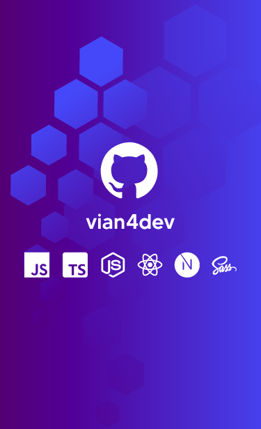

<h1 align="left">Hello 👋, I'm Gabriel Viana.</h1>

  

- 🔥 Dedicating myself to studying and improving the development of Full-Stack AI applications.

- 🔭 I currently work as a **Freelancer Full-Stack Developer and N2 Support Analyst**

- 💬 Pergunte sobre: **JavaScript, TypeScript, Node.js, React, Next, SASS, TailWind, Python e IA**

- ❤️ Hobby: **Having fun with retro games, extreme sports with friends**.

 

## 🔖 Contacts

